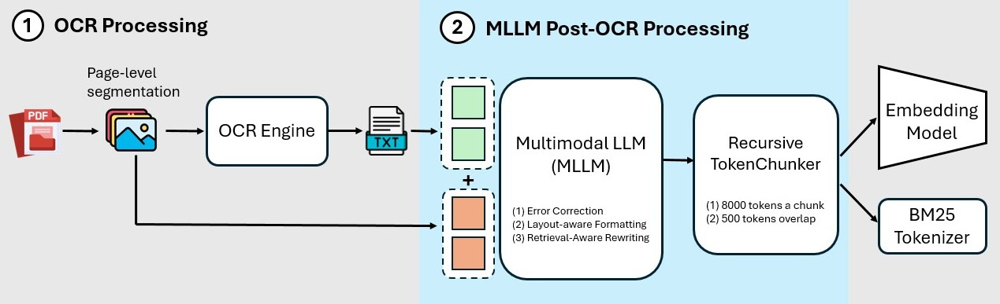

# KAP: MLLM-assisted OCR Text Enhancement for Hybrid Retrieval in Chinese Non-Narrative Documents

Official Code Repository for the paper ["KAP: MLLM-assisted OCR Text Enhancement for Hybrid Retrieval in Chinese Non-Narrative Documents"](https://arxiv.org/pdf/2503.08452).

## Abstract

<div align="center">
  
</div>
Hybrid Retrieval systems, combining Sparse and Dense Retrieval methods, struggle with Traditional Chinese non-narrative documents due to their complex formatting and rich vocabulary where common embedding models often fail to understand synonyms. Previous approaches inadequately address the dual needs of these systems, which require both high-quality tokens for Sparse Retrieval and semantically coherent text for Dense Retrieval. We propose Knowledge-Aware Preprocessing (KAP), a two-stage framework that first extracts text using OCR, then employs Multimodal Large Language Models to improve the OCR output by integrating visual information from the original documents. KAP reduces OCR noise, restores structural elements, and formats text to satisfy the distinct requirements of both retrieval methods. Empirical results demonstrate that KAP consistently and significantly outperforms conventional preprocessing approaches.

## Installation

### 1. Clone the Repository
Clone the repository and navigate into the project directory:
```bash
git clone https://github.com/JustinHsu1019/KAP.git
cd KAP
```

### 2. Set Up a Virtual Environment
Create and activate a virtual environment:
```bash
python3 -m venv kap_venv
source kap_venv/bin/activate
```

### 3. Install Dependencies
Install all required dependencies:
```bash
pip install -r requirements.txt
```
Additionally, install OCR and Docker-related dependencies:
```bash
./exp_src/preprocess/ocr/tessocr.sh
./exp_src/docker/docker_install.sh
```

### 4. Configure API Keys
Copy the example configuration file and set up your API keys:
```bash
cp config.ini config_real.ini
```
Edit `config_real.ini` and manually add your API keys:
- **OpenAI API Key**: Obtain from the [OpenAI official website](https://platform.openai.com/).
- **Claude API Key**: Obtain from the [Claude official website](https://www.anthropic.com/).

### 5. Set Up the Database (Weaviate via Docker)
Navigate to the `docker` directory:
```bash
cd exp_src/docker
```
Modify the `docker-compose.yml` file:
- Replace the following line with your actual OpenAI API Key:
  ```yaml
  OPENAI_APIKEY: ${OPENAI_APIKEY}
  ```

Start the Weaviate database using Docker Compose:
```bash
docker-compose up -d
```

### 6. Obtain and Prepare the Dataset
- The dataset used in this study is **privately provided by E.SUN Bank**. You must obtain authorization from E.SUN Bank to access the dataset.
- If you want to reproduce our methodology, you can use any other dataset with **a large number of tabular Chinese PDFs**.
- Once obtained, place the dataset in the `data/` directory.

## Running the Full Experimental Pipeline

### 1. Data Augmentation
Generate augmented validation sets for evaluation:
```bash
python3 exp_src/auto_runall_pipeline/question_augment.py
```

### 2. Convert PDFs to Images
Convert all PDFs into images for downstream processing:
```bash
python3 exp_src/convert_pdfs_to_images.py
```

### 3. Generate OCR Text
Extract OCR text using the baseline **Tesseract OCR**:
```bash
python3 exp_src/rewrite.py --task Tess
```

### 4. Generate Preprocessed Text for All Settings
Run all text preprocessing pipelines, including **ablation studies, and our proposed KAP framework**:
```bash
python3 exp_src/auto_runall_pipeline/run_all_rewrite.py
```

### 5. Perform Text Embedding and Store in the Vector Database  
Convert the processed text into **vector representations** and store them in the **Weaviate vector database**. This step includes:  
- **Text embedding** using OpenAI Embedding Model (for vector retrieval)
- **Tokenization** using Jieba (for bm25 retrieval)  
- **Storing the processed embeddings** in the vector database  

Run the following command to execute the full pipeline:  
```bash
python3 exp_src/auto_runall_pipeline/run_all_db_insert.py
```

### 6. Run Hybrid Retrieval Experiments
Execute retrieval experiments using **pure sparse retrieval, dense retrieval, and hybrid retrieval**:
```bash
python3 exp_src/auto_runall_pipeline/run_all_hybrid.py
```

### 7. Reproduce Experimental Results
To **validate stability**, our experiments were repeated three times in the paper. You may **repeat steps 1-6 multiple times** to reproduce and verify results.

## Additional Information

### **Prompt Engineering for Post-OCR Correction**
The **core** of our approach is **MLLM-assisted Post-OCR enhancement**.  
To **view or modify** the prompts used for this step, navigate to:
```bash
cd exp_src/preprocess/ocr/
```
This directory contains **all ablation experiments** and our **framework's prompt designs**.

## Acknowledgement
This study was supported by E.SUN Bank, which provided the dataset from the "AI CUP 2024 E.SUN Artificial Intelligence Open Competition." We sincerely appreciate E.SUN Bank for its generous data support, which has been invaluable to this research.

## Citation
If you found the provided code with our paper useful, we kindly request that you cite our work.
```BibTex
@misc{hsu2025kapmllmassistedocrtext,
      title={KAP: MLLM-assisted OCR Text Enhancement for Hybrid Retrieval in Chinese Non-Narrative Documents}, 
      author={Hsin-Ling Hsu and Ping-Sheng Lin and Jing-Di Lin and Jengnan Tzeng},
      year={2025},
      eprint={2503.08452},
      archivePrefix={arXiv},
      primaryClass={cs.IR},
      url={https://arxiv.org/abs/2503.08452}, 
}
```
